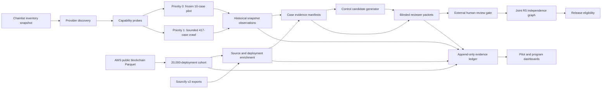

# ChronosAudit Public-Evidence Acquisition Design

Status: APPROVED DESIGN, pending user review of this recorded specification  
Design date: 2026-08-08  
System: ChronosAudit  
Scope: public-data-only acquisition, historical-state verification, denominator construction, reviewer preparation, and fail-closed counter projection  
Authority: public RPC and public-data access are authorized; paid/private archive services and claims of independent human adjudication are not authorized by this design

## 1. Decision

ChronosAudit will use a hybrid acquisition architecture with two execution lanes:

1. A prespecified, evidence-grade pilot of 10 cases stratified across Ethereum, BNB Smart Chain, Base, and Arbitrum.
2. An immediate bounded full crawl that queues all 417 cases, accepting substantially higher rate-limit, missing-history, and unreliable-provider risk.

Both lanes use the same evidence contracts and fail-closed counter rules. A case being queued, attempted, retried, or partially observed never counts as a verified historical snapshot. The pilot remains a fixed diagnostic cohort even if the full crawl produces more successful cases.

The deployment-denominator lane will independently attempt to materialize a deterministic 20,000-contract study cohort, initially stratified as 5,000 contracts per chain. It is not restricted to Sourcify-verified contracts.

## 2. Research boundary

The acquisition system may establish machine-verifiable facts such as:

- which public data inventories were available at a recorded time;
- which provider endpoint was queried through a redacted identifier;
- whether a provider returned a historical block, code, storage, or proof response;
- whether independently operated provider families agreed;
- whether a deployment row has creation provenance and survives deterministic validation;
- whether a case or control candidate satisfies machine-readable admissibility predicates.

The system may not establish by itself:

- independent scholarly or expert adjudication;
- reviewer identity or independence without accountable out-of-band evidence;
- exploit-mechanism truth from an AI or public incident label alone;
- mature-negative status from the absence of a discovered incident;
- independent R5 membership before the required labels and lineage graph are finalized;
- release eligibility by relaxing a missing mandatory gate.

## 3. Architecture

## 4. Public source roles

### 4.1 Chainlist

Source: <https://chainlist.org/rpcs.json>

Role: endpoint discovery only.

Chainlist entries do not prove archive retention, EIP-1898 support, accuracy, provider independence, terms suitability, or operational reliability. The raw inventory must be preserved with retrieval time, response hash, and source URL. Endpoints containing embedded keys, templates, user identifiers, or tracking tokens are excluded from the default public pool.

### 4.2 AWS Public Blockchain Data

Source: <https://registry.opendata.aws/aws-public-blockchain/>

Role: primary bulk source for the 20,000-deployment cohort and creation-level provenance when the chain-specific schema supports it.

The registry currently identifies public daily Parquet datasets for Ethereum, BNB Chain, Base, and Arbitrum. Each consumed object must retain its bucket key, object metadata, size, modification time or equivalent inventory field, and content hash when downloaded. Dataset-provider identity remains part of provenance: Ethereum is maintained by AWS, BNB Chain by BNB Chain, and Base/Arbitrum by SonarX according to the registry.

### 4.3 Sourcify v2 export

Source: <https://docs.sourcify.dev/docs/repository/download-dataset/>

Role: verified-source, compilation, code, and deployment enrichment.

The v2 export exposes Parquet tables including `contract_deployments`, `verified_contracts`, `sources`, `compiled_contracts`, and `code`. Sourcify coverage is selective and therefore may not define the deployment denominator. Listing metadata, ETag, object key, size, and last-modified time must be preserved.

### 4.4 Public JSON-RPC providers

Role: historical-state capability testing and cross-provider observation.

Provider claims are not accepted as evidence of archive capability. The system actively probes each relevant historical block and records the method-level result. EIP-1898 block-hash selectors are required for strict closure; providers that do not support them may contribute partial evidence only. The governing reference is <https://eips.ethereum.org/EIPS/eip-1898> and the baseline method semantics are documented at <https://ethereum.org/developers/docs/apis/json-rpc/>.

## 5. Execution lanes

### 5.1 Frozen 10-case pilot

The pilot selection is generated once from the canonical 417-case inventory before live response outcomes are inspected.

Selection requirements:

- coverage of all four chains;
- a frozen allocation and deterministic seed recorded in the pilot manifest;
- representation of older and newer incident blocks where available;
- representation of direct and proxy-like contracts where derivable without live-outcome selection;
- no replacement of a failed case after observing provider results;
- pilot membership hash bound to the exact input inventory revision.

Recommended allocation is 3 Ethereum, 3 BNB Smart Chain, 2 Base, and 2 Arbitrum cases. Within a chain, deterministic hash ranking is applied inside prespecified age/proxy strata. If a stratum is empty, the allocation rule and resulting shortfall are recorded rather than silently improvised.

### 5.2 Immediate bounded full crawl

All 417 canonical cases are placed in the acquisition queue on the first authorized live run.

The full crawl must remain bounded:

- pilot cases receive priority 0; the remaining cases receive priority 1;
- per-provider and global concurrency limits are explicit configuration;
- exponential backoff includes jitter and a maximum retry count;
- retry budgets are stored per case, provider family, method, and block selector;
- `429`, timeout, historical-state-unavailable, unsupported-method, malformed-response, provider-disagreement, and policy-exclusion outcomes remain distinct;
- resumability operates at case x provider x method granularity;
- a partially observed case is never treated as complete;
- no endpoint is hammered after a rate-limit or service-health stop condition;
- every success and failure is append-only and never overwritten.

The first pass may therefore finish with any combination of verified, partial, unavailable, disputed, or unattempted observations. The program counter increases only for strict verified cases.

### 5.3 Deployment-denominator lane

The initial target is exactly 20,000 unique creation events, allocated as 5,000 per chain.

Selection occurs from frozen public-data object inventories and a frozen extraction cutoff. Within each chain, eligible creation events are ranked deterministically using a recorded seed and stable creation identifier. Chain shortfalls are not automatically reallocated because doing so would alter the prespecified chain composition.

Top-level contract-creation transactions and internal `CREATE`/`CREATE2` events are included only when the source schema provides creation proof. Rows inferred solely from current code presence are excluded.

## 6. Historical-snapshot evidence contract

A strict historical snapshot requires all of the following:

1. Canonical case ID, chain ID, contract address, incident block, and prediction-cutoff block.
2. Prediction cutoff frozen for that case as the block immediately before the earliest verified exploit transaction, unless the canonical case already supplies a stricter prespecified cutoff. The transaction anchor is resolved in this order: a transaction hash already frozen in the canonical case manifest and validated by receipt; a transaction hash from frozen incident evidence and independently validated on chain; otherwise unresolved. An unresolved anchor makes the case `PARTIAL` and blocks strict historical-snapshot closure.
3. Two provider-family observations with independently evidenced operators.
4. Agreement on chain ID, cutoff block number, and cutoff block hash.
5. Hash-pinned `eth_getCode` agreement for the subject address.
6. EIP-1967 implementation, beacon, and admin slot observations when applicable.
7. Beacon implementation resolution when the beacon slot is nonzero and resolvable.
8. Hash-pinned code observation for every resolved implementation address.
9. Raw JSON-RPC response preservation or a byte-exact response artifact plus SHA-256.
10. Request method, normalized parameters, UTC start/end time, endpoint pseudonym, provider-family ID, HTTP/RPC status, retry number, and tool version.
11. No unresolved disagreement affecting contract identity.

The strict provider-family rule concerns operators, not URL count. Multiple gateways or URLs controlled by the same operator count as one family. Provider ownership evidence is maintained in a versioned registry with source URLs and retrieval dates.

If EIP-1898 is unsupported, block-number queries may be retained as partial evidence with pre/post block-hash checks, but they do not close the strict historical-snapshot counter under this design.

## 7. Deployment-row evidence contract

Every denominator row requires:

- `deployment_id`;
- `chain_id`;
- normalized contract address;
- creation transaction hash or equivalent creation-event identifier;
- creation type: top-level, `CREATE`, or `CREATE2`;
- deployment block number and block hash when available;
- deployment timestamp;
- creator address when available;
- runtime-code hash or a documented reason it is unavailable;
- source dataset and provider identity;
- source object key and object metadata;
- extraction revision and query/plan hash;
- raw-row or source-record hash;
- inclusion/exclusion status and reason;
- duplicate-group identifier;
- admissibility revision.

Deduplication key precedence is chain plus canonical creation event. Chain plus address is used as a secondary integrity check, not as the sole creation identity where redeployment semantics may matter.

At least 200 deterministically selected denominator rows, 50 per chain, are cross-checked against an independent public observation source when feasible. Cross-check failure does not silently delete the row; it marks the row disputed or partial.

## 8. Control-candidate and qualification contract

The pilot attempts to generate 100 control candidates: 10 for each frozen pilot case.

Candidate generation requires:

- deployment no later than the positive case prediction cutoff;
- same-chain risk-set membership;
- explicit activity, exposure, or observability predicate defined before selection;
- no pre-cutoff known exploit in the frozen public incident sources;
- no prohibited protocol, entity, source clone, bytecode clone, proxy implementation, attacker clone, or mechanism-family linkage detectable at the current evidence maturity;
- deterministic matching and tie-breaking;
- explicit censoring start, censoring horizon, and follow-up status.

Candidate status is not qualified-control status. Qualification additionally requires the prespecified maturity window, investigated-negative evidence, and independent outcome review. “No incident found” is insufficient. Until those conditions close, the canonical qualified-control counter remains unchanged.

## 9. Independent adjudication workflow

The software may prepare, validate, blind, assign, hash, and reconcile reviewer packets. It may not impersonate an independent reviewer.

A finalized independent adjudication requires:

- reviewer A and reviewer B with distinct accountable identities;
- conflict-of-interest and independence declarations;
- blinded case packets with immutable hashes;
- original reviewer submissions preserved unchanged;
- protocol-family, mechanism-family, outcome, confidence, rationale, and evidence references;
- third adjudicator for disagreements;
- append-only reconciliation output;
- reviewer-agreement statistics;
- a frozen 10% blinded re-review sample where the governing policy requires it;
- signed or otherwise authenticated submission provenance.

Public incident taxonomies, benchmark labels, and AI-generated mappings are candidate evidence only.

## 10. Counter projection

The dashboard exposes separate program and pilot views.

| Counter | Pilot target | Program numerator rule |
| --- | ---: | --- |
| Historical snapshots | 10 strict closures attempted | Count every case satisfying Section 6, whether pilot or full crawl |
| Independent adjudications | 10 positive-case packets prepared; finalized target remains externally dependent | Count only externally finalized positive-case decisions |
| Deployment denominator | 20,000 strict rows | Count unique rows satisfying Section 7 |
| Qualified controls | 100 candidates; qualification fail-closed | Count only controls satisfying Section 8 in full |
| Independent R5 blocks | No positive target before adjudication | Count only finalized graph components with adjudicated mechanism and lineage inputs |
| Release-eligible cases | No positive target before all gates close | Count only cases passing every mandatory release predicate |

Every dashboard count must be reproducible from row-level manifests. Summary JSON or prose cannot assign a counter directly.

Packet-preparation workload is reported through separate operational fields: `positive_case_review_packets`, `control_review_packets`, and `finalized_positive_adjudications`. Candidate-control packets are never combined with or presented as progress on the canonical positive-case independent-adjudication counter.

## 11. State model

Minimum acquisition states:

- `NOT_QUEUED`
- `QUEUED`
- `ATTEMPTED`
- `PARTIAL`
- `VERIFIED`
- `DISPUTED`
- `UNAVAILABLE`
- `POLICY_EXCLUDED`
- `WAITING_EXTERNAL`
- `STALE`

Minimum row-level fields:

- `status_program`;
- `status_pilot`;
- `evidence_complete`;
- `blocked_reason`;
- `requires_external_human`;
- `requires_archive_provider`;
- `raw_payload_sha256`;
- `canonical_block_hash`;
- `provider_family_ids`;
- `source_inventory_revision`;
- `admissibility_revision`;
- `attempt_count`;
- `last_attempt_utc`;
- `next_resume_action`.

State transitions are derived from evidence predicates and validated against an allowed-transition table. A retry adds an event; it does not erase the failed observation.

## 12. Planned implementation surfaces

The implementation plan may refine names, but ownership will be separated across these concerns:

- source-inventory snapshot and hashing;
- endpoint parsing, redaction, operator-family registry, and capability probing;
- historical snapshot collection and consensus;
- AWS/Sourcify inventory and Parquet ingestion;
- deterministic denominator and control-candidate selection;
- review-packet generation and external-review import validation;
- append-only evidence/event ledger;
- counter projection and dashboard reports;
- schemas, configuration, fixtures, unit tests, integration tests, and runbook.

The current `run_live_stage2_evidence.py --public-providers` path must be repaired before use because it supplies raw URL strings where `historical_identity_snapshot` expects provider objects. Provider-family identity must also become part of the observation and consensus contract.

## 13. Security, privacy, and source-rights controls

- No endpoint URL containing credentials is written to evidence artifacts.
- Endpoint records use redacted display values and deterministic pseudonymous IDs.
- Environment variables remain the only supported location for private credentials if later authorized.
- Public endpoint requests contain only public chain identifiers, addresses, blocks, and methods.
- Terms, robots/access constraints, stated rate limits, and source licenses are recorded where available.
- No dynamic download-and-execute behavior is introduced.
- Networked acquisition runs separately from offline analysis and release projection.
- Downloaded Parquet and JSON artifacts are treated as untrusted data and parsed with bounded sizes and explicit schemas.
- Concurrency, response-size, retry, elapsed-time, and disk-budget limits are configured and recorded.
- Paid APIs, private archives, proprietary databases, and authenticated browser sessions require separate authorization.

## 14. Failure and recovery behavior

Failures are classified as:

- endpoint discovery failure;
- operator-family unresolved;
- network timeout;
- HTTP rate limit;
- RPC transport failure;
- method unsupported;
- historical state unavailable;
- block not found;
- block-hash mismatch;
- code/storage disagreement;
- response malformed or oversized;
- bulk-source inventory or schema drift;
- source-rights uncertainty;
- reviewer or authority dependency;
- local validation failure.

Each class has a bounded retry or a stop disposition. Materially identical failed strategies are not repeated indefinitely. The run remains resumable from the smallest incomplete cell.

## 15. Outputs and provenance

The live workflow must preserve:

- raw and normalized source inventories;
- endpoint and operator-family registry revisions;
- capability-probe observations;
- per-case request and response artifacts;
- pilot selection manifest;
- 417-case queue manifest;
- deployment-cohort manifest and extraction plan;
- denominator validation and shortfall report;
- control-candidate manifest;
- reviewer packets and packet hashes;
- acquisition event ledger;
- disagreement and exclusion reports;
- pilot and program counter projections;
- machine-readable validation report;
- human-readable run report;
- environment, dependency, command, configuration, and code revision metadata.

All authoritative artifacts receive SHA-256 hashes and cross-references. Existing canonical files are not silently replaced; new revisions and derivations preserve lineage.

## 16. Verification and acceptance criteria

Implementation acceptance requires:

1. Static tests for URL redaction, provider-family identity, state transitions, EIP-1898 requests, proxy-slot resolution, response hashing, denominator deduplication, deterministic selection, and fail-closed counters.
2. Integration fixtures for provider agreement, provider disagreement, rate limiting, archive unavailability, malformed responses, and schema drift.
3. A bounded live capability smoke test before the full queue consumes retry budgets.
4. All 417 cases present in the queue manifest.
5. The frozen 10-case pilot manifest exactly reproducible from its input hash, seed, and selection policy.
6. Exactly 20,000 denominator rows if all four 5,000-row strata close; otherwise a reproducible shortfall report without reallocation.
7. No independent-adjudication increment from AI or same-owner review.
8. No qualified-control increment from candidate status alone.
9. No R5 or release increment with unresolved mandatory dependencies.
10. Existing relevant ChronosAudit tests plus new acquisition tests pass.
11. The canonical case checker is rerun and its output preserved.
12. The research phase is not automatically promoted by acquisition success.

## 17. Self-review

The design was reviewed against the requested counters, current ChronosAudit fail-closed policies, the existing collector interfaces, and present public-source capabilities.

The principal risks retained deliberately are:

- free public endpoints may not offer the required historical state;
- distinct URLs may hide common upstream infrastructure;
- bulk dataset schemas may differ by chain or omit internal creations;
- 20,000 deployment rows may be obtainable while control qualification remains blocked;
- the full crawl may have a low success rate despite complete attempt coverage;
- independent adjudication, R5, and release gates require accountable external work.

These risks do not justify weakening the counters. The design therefore treats the full crawl as evidence acquisition, not as evidence certification.

## 18. Approval record

The user approved the hybrid evidence-grade pilot and explicitly requested addition of an immediate full crawl over all 417 cases on 2026-08-08. This specification records that decision while preserving bounded execution, public-data-only authority, and strict separation between attempted and verified evidence.
