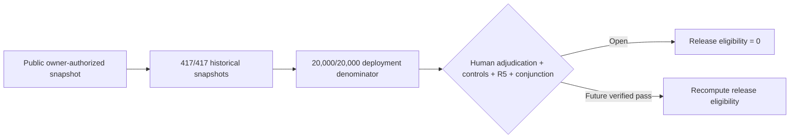

# ChronosAudit

ChronosAudit is an evidence-gated research program for pre-incident smart-contract exploit evaluation, historical-state reconstruction, temporal and identity auditing, and reproducible benchmark qualification.

This public umbrella repository captures the current full GitHub-compatible research workspace as of 30 August 2026. It preserves the active source, tests, configurations, manuscripts, reports, figures, QA records, provenance, processed evidence that fits GitHub limits, the TemporalClone Minimum Publishable Prototype (MPP), and the original research-case materials.

Repository owner, research-program maintainer, and public-release authority:
**Zubaer Mahmood Zubraj** ([`@zmzubraj`](https://github.com/zmzubraj)).
The owner authorized this GitHub-compatible snapshot to remain publicly
accessible on 30 August 2026. Public hosting does not change any scientific
counter, evidence maturity, release-eligibility gate, or manuscript decision.

## Start here

1. Read [ChronosAudit_Research_Latest/CONTINUE_HERE.md](ChronosAudit_Research_Latest/CONTINUE_HERE.md). It is the sole human-readable current-status and continuation authority for the main research program.
2. Read [ChronosAudit_Research_Latest/AGENTS.md](ChronosAudit_Research_Latest/AGENTS.md) before changing the main program.
3. For the 417-case TemporalClone MPP, open [ChronosAudit_TemporalClone_MPP/README.md](ChronosAudit_TemporalClone_MPP/README.md) and its [project index](ChronosAudit_TemporalClone_MPP/INDEX.md).
4. Review [EXPORT_SCOPE.md](EXPORT_SCOPE.md) before treating this repository as a complete data archive.

## Repository map

| Path | Contents |
|---|---|
| `ChronosAudit_Research_Latest/` | Main research workspace: manuscript, executable artifact, source, tests, reports, figures, QA, provenance, build scripts, and current status |
| `ChronosAudit_TemporalClone_MPP/` | Complete GitHub-compatible MPP for temporal eligibility, identity dependence, and proxy-linkage auditing of 417 incidents |
| `research-case/` | Original evidence-gated research-case materials |
| `intake.md` | Original main-program intake |
| `ChronosAudit_TemporalClone_MPP.intake.md` | TemporalClone MPP intake |
| `EXPORT_SCOPE.md` | Included/excluded data boundary and source snapshot provenance |

## Current scientific status

The main ChronosAudit program remains fail-closed. The current canonical status records 417/417 historical snapshots and a 20,000/20,000 deployment denominator, while independent human adjudications, the complete control cohort, qualified controls, independent R5 blocks, and release eligibility remain open. The associated research manuscript is a `HUMAN-REVIEW DRAFT — CONCEPT ONLY`: canonical phase `INTAKE`, novelty `UNRESOLVED`, solution viability `ASSERTED_ONLY`, feasibility disposition `PILOT_FIRST`, acceptance readiness `NOT_ASSESSABLE`, and detector-performance/prospective results `NOT RUN`. The authoritative current counters and blockers are in `ChronosAudit_Research_Latest/CONTINUE_HERE.md`.

The TemporalClone MPP is mechanically complete as a draft and reproducibility bundle. Its canonical phase is `INTAKE`, novelty is `UNRESOLVED`, solution viability is `ASSERTED_ONLY`, and acceptance readiness is `NOT_ASSESSABLE`; independent novelty challenge, independent clean-machine reproduction, final author metadata/declarations, redistribution-rights review, licence selection, and human submission approval remain open.

Nothing in this repository should be interpreted as journal acceptance, scientific-release eligibility, independent validation, detector-performance evidence, or permission to increment any gated scientific counter.

## Data and credential boundary

The local ChronosAudit workspace is approximately 49 GB. Raw RPC/provider acquisitions, local credentials, virtual environments, worktrees, inaccessible legacy pre-fix records, credential-bearing provider logs, and files exceeding the repository's 90 MiB export ceiling are intentionally excluded. Canonical manifests, hashes, processed results, reports, and reconstruction instructions are retained where GitHub-compatible.

No repository-wide reuse licence is granted by public hosting. Public visibility is owner-authorized; copying, redistribution, or relicensing beyond applicable platform permissions still requires the recorded rights review, licence selection, and accountable human approval.

## Snapshot provenance

- Export date: 30 August 2026
- Main source checkout: `ChronosAudit_Research_Latest`
- Source `HEAD`: `59f0935b98e2524b2b7a70c5a5f4de3189161706`
- Snapshot state: current working tree, including 55 modified/deleted tracked entries and 322 untracked paths present at export time
- Export policy: preserve current relevant files without modifying the source checkout; omit only the boundaries documented in `EXPORT_SCOPE.md`
